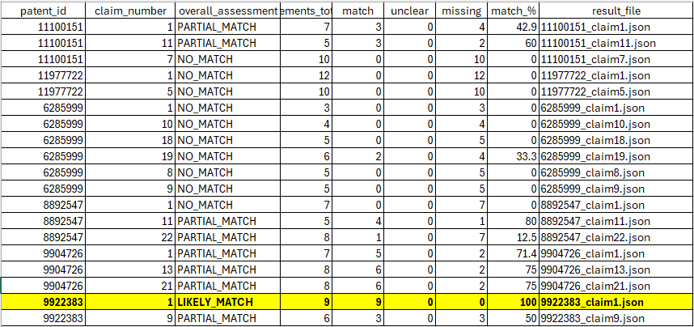

# patent-claim-mapper

## Overview

**patent-claim-mapper** explores whether modern AI systems can perform
structured **claim-level technical correspondence analysis** between an
invention description and issued patent claims.

The project evaluates whether AI can approximate the reasoning process
underlying a **claim chart**, including element decomposition, feature
matching, and identification of missing limitations.

Importantly, this system does **not** perform patent search or legal
infringement analysis. Instead, it focuses on a controlled experimental
setting where patents are pre-selected and the objective is to measure
technical correspondence detection.

------------------------------------------------------------------------

## Research Objective

The central question:

> Can AI reliably determine whether an invention description reads on a
> patent claim when both are provided explicitly?

This requires multiple reasoning steps:

1.  Reading and interpreting an invention description\
2.  Extracting independent claims from patents\
3.  Decomposing claims into elements and sub-elements\
4.  Identifying feature correspondence\
5.  Detecting missing limitations\
6.  Providing textual evidence\
7.  Estimating overall correspondence confidence

The resulting task approximates automated **claim chart reasoning**.

------------------------------------------------------------------------

## Experimental "Intentional Infringement" Scenario

A synthetic product concept is intentionally designed to read on certain
patents in the dataset to evaluate discrimination capability.

Example concept:

> A computer-implemented platform that receives a user invention
> description and a set of patent documents, automatically extracts
> independent claims from the patent documents, parses the claims into
> hierarchical elements and sub-elements, extracts technical features
> from the invention description, and compares the extracted features to
> the claim elements using machine learning or semantic analysis models
> to generate a claim mapping report indicating matches, missing
> elements, and confidence scores. The system may visually link mapping
> results to corresponding claim elements and provide interactive
> exploration of the mappings.

This allows measurement of whether the system correctly identifies:

-   Strong correspondence with target patents\
-   Weaker correspondence with unrelated patents

------------------------------------------------------------------------

## Dataset Design

A small controlled patent corpus is used to create a similarity
gradient:

  Role              Patent No.
  ----------------- ------------
  Anchor            9,922,383
  Strong neighbor   9,904,726
  Medium neighbor   8,892,547
  Weak neighbor     11,100,151
  Weak neighbor     11,977,722
  Outlier           6,285,999

The expected behavior:

-   Highest correspondence → Anchor patents\
-   Moderate correspondence → Related patents\
-   Minimal correspondence → Outlier

This structure enables evaluation of ranking and discrimination
capability.

------------------------------------------------------------------------

## System Architecture

The pipeline follows an **acquire once, analyze many** workflow:

### 1. Patent Acquisition

Patents are retrieved from Google Patents and parsed into structured
JSON:

-   Title\
-   Abstract\
-   Claims\
-   Metadata

### 2. Independent Claim Extraction

Independent claims are identified using textual heuristics (absence of
claim dependency references).

### 3. Injection Payload Construction

Simplified JSON payloads are created containing:

-   Patent metadata\
-   Independent claims\
-   Abstract

These payloads are optimized for AI analysis.

### 4. Claim Mapping Analysis

For each independent claim, the system:

-   Breaks the claim into coarse elements\

-   Compares elements against invention features\

-   Labels each element:

    -   MATCH\
    -   MISSING\
    -   UNCLEAR

-   Generates structured reasoning output in JSON format.

### 5. Result Aggregation

Outputs are summarized into a CSV report including:

-   Match percentages\
-   Element counts\
-   Overall assessments

------------------------------------------------------------------------

# Results --- Anchor Patent Validation

## Anchor Patent Performance

The system was evaluated on a controlled patent corpus designed to
produce a similarity gradient between the invention description and
selected patents.

The primary objective was to determine whether the pipeline could
correctly identify stronger correspondence with the anchor patents while
minimizing correspondence with unrelated patents.

The strongest result was observed for **U.S. Patent No. 9,922,383 ---
Claim 1**, which served as the anchor patent intentionally targeted by
the synthetic invention description.

The system produced:

-   **Overall assessment:** LIKELY_MATCH\
-   **Elements evaluated:** 9\
-   **Matched elements:** 9\
-   **Missing elements:** 0\
-   **Match percentage:** 100%

This represents complete element-level correspondence between the
invention description and the claim.

Notably, the model identified explicit textual evidence from the
invention description for each claim element, indicating that the
pipeline successfully performed:

-   Claim decomposition\
-   Feature extraction\
-   Element-level mapping\
-   Evidence grounding

The perfect correspondence score for the anchor claim demonstrates that
the system can detect strong technical alignment when present.

------------------------------------------------------------------------

## Anchor Claim Text (U.S. Patent No. 9,922,383 --- Claim 1)

To provide transparency and allow independent evaluation of the
correspondence analysis, the full text of the highest-scoring claim is
reproduced below.

> **Claim 1.** A system for analyzing patent claims, the system
> comprising:\
> at least one input device in communication with at least one computer
> and at least one output device, wherein the at least one computer is
> capable of storing, modifying, outputting, and retrieving information
> via an electronic network from the at least one input device and the
> at least one output device;\
> at least one database, the database in network communication with the
> at least one computer; and\
> software installed and capable of running on the at least one computer
> for automatically:\
> importing patent claims via the electronic network based upon the user
> inputted information;\
> parsing the imported patent claims hierarchically, wherein each
> independent claim is parsed into its invention sub-elements, wherein
> an invention sub-element is a parsed patent invention element or a
> step of the independent patent invention claim, and wherein the
> hierarchically parsed patent claims comprises hierarchical elements
> and sub-elements;\
> generating a hierarchical claims diagram comprising a textual claim
> content associated with each patent claim, and\
> outputting the hierarchical claims diagram, wherein, for each patent
> claim, the hierarchical claims diagram shows the parsed claims in an
> interactive format that is operable to dynamically expand and compress
> the textual claim content, according to the hierarchy of the imported
> patent claims;\
> receiving sub-element selections from the input device;\
> analyzing the sub-element selections for technology content;\
> searching the at least one database in real-time via the network for
> matching technology content;\
> receiving a study purpose;\
> analyzing in real-time via the network a matching technology content
> record for matching study purpose;\
> retrieving in real-time from the Internet the matching technology and
> study purpose content;\
> displaying on a GUI matching technology and study purpose content
> thumbnail images beside the patent claims diagram; and\
> visually linking the thumbnail images to their sub-element.

------------------------------------------------------------------------

## Correspondence Interpretation

The invention description used in this experiment explicitly included
functionality involving:

-   Automated claim import and parsing\
-   Hierarchical decomposition into claim elements\
-   Mapping invention features to claim elements\
-   Generation of claim mapping outputs\
-   Visual linking between elements and results

These features align closely with the structural and functional
limitations recited in Claim 1, particularly those relating to:

-   Hierarchical claim parsing\
-   Diagram generation and visualization\
-   Element selection and analysis\
-   Database searching and retrieval\
-   Visual linkage of results to claim sub-elements

The system identified supporting textual evidence for all claim
elements, resulting in:

-   **9 / 9 elements matched**\
-   **0 missing elements**\
-   **Overall assessment:** LIKELY_MATCH

This complete correspondence supports the validity of the pipeline's
ability to detect strong technical alignment when present.

------------------------------------------------------------------------

## Gradient Behavior Across Dataset



The broader dataset exhibited the expected similarity gradient:

- **Anchor (9,922,383):** LIKELY_MATCH / highest scores  
- **Strong Neighbor (9,904,726):** High PARTIAL_MATCH (~70–75%)  
- **Medium Neighbor (8,892,547):** Moderate PARTIAL_MATCH  
- **Weak Neighbors:** NO_MATCH  
- **Outlier (6,285,999):** Predominantly NO_MATCH  

This pattern indicates that the system demonstrates discriminative capability across patents with varying conceptual similarity.

------------------------------------------------------------------------

## Conclusion

The experiment demonstrates that structured AI pipelines can:

-   Map invention descriptions to patent claim elements\
-   Detect missing limitations\
-   Rank correspondence strength across patents

The successful identification of Claim 1 of U.S. 9,922,383 as the top
match provides strong preliminary validation of the approach.


------------------------------------------------------------------------

## Example Output Schema

``` json
{
  "patent_id": "9922383",
  "claim_number": 1,
  "overall_assessment": "LIKELY_MATCH",
  "elements": [
    {
      "element_id": "E1",
      "element_text": "...",
      "status": "MATCH",
      "invention_evidence": ["..."],
      "notes": "..."
    }
  ],
  "missing_elements": [],
  "summary": "..."
}
```

------------------------------------------------------------------------

## What Is Being Evaluated

The project measures whether AI can perform:

-   Structured claim decomposition\
-   Evidence-grounded reasoning\
-   Element-level correspondence detection\
-   Missing limitation identification\
-   Confidence estimation

This represents a step toward automated **technical claim chart
generation**.

------------------------------------------------------------------------

## Scope and Caveats

Important limitations:

-   Patents are **pre-selected** (no search component).\
-   Results are **experimental**.\
-   Outputs are **not legal advice**.\
-   The system does **not determine infringement**.\
-   Claim interpretation is simplified compared to real legal analysis.

The purpose is to evaluate technical feasibility, not legal conclusions.

------------------------------------------------------------------------

## Why This Matters

Claim mapping is one of the most time-consuming tasks in patent
practice, including:

-   Freedom-to-operate analysis\
-   Invalidity analysis\
-   Litigation preparation\
-   Patent drafting support\
-   Competitive intelligence

Demonstrating reliable AI assistance in this domain could significantly
impact legal workflows.

------------------------------------------------------------------------

## Future Directions

Potential extensions:

-   Multi-claim aggregation scoring\
-   Cross-patent ranking\
-   Embedding-based similarity pre-filtering\
-   GUI visualization of claim charts\
-   Integration with patent search pipelines\
-   Local model deployment for confidential environments

------------------------------------------------------------------------

## Repository Structure

    patent_dump/        Raw scraped patent data
    inject_dump/        Independent claim payloads
    results_dump/       AI analysis outputs
    summary_report.csv  Aggregated results

------------------------------------------------------------------------

## Disclaimer

This project is a technical research prototype.

It does not provide legal opinions, infringement determinations, or
patentability analysis.

------------------------------------------------------------------------

## License

\[Add your license here\]

------------------------------------------------------------------------

## Suggested Citation

If referencing this work:

> Tomlinson, M.J. --- Patent Claim Mapper: Evaluating AI-Based Technical
> Correspondence Detection Between Invention Descriptions and Patent
> Claims.
